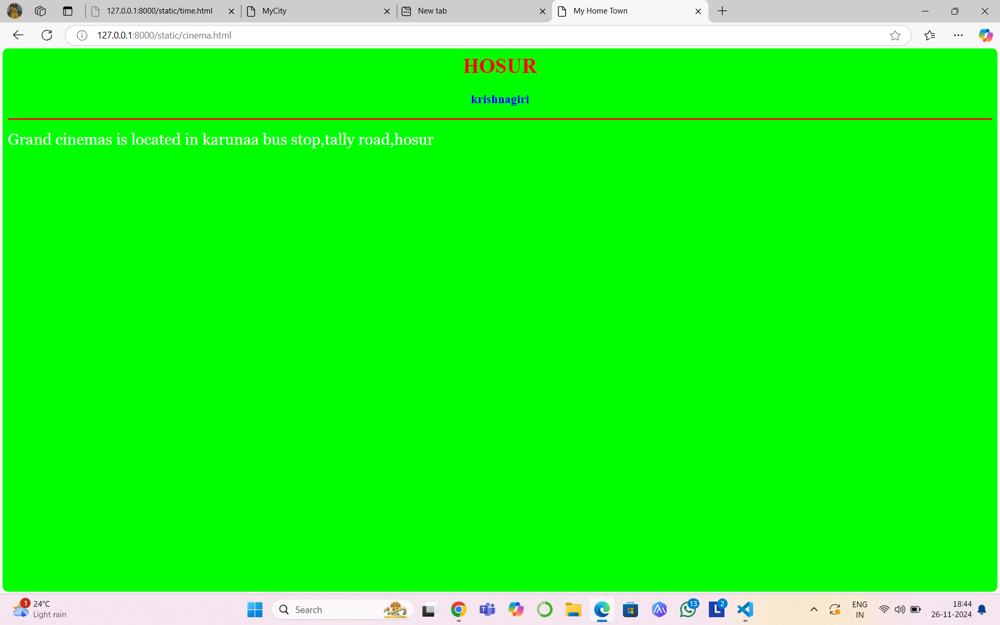
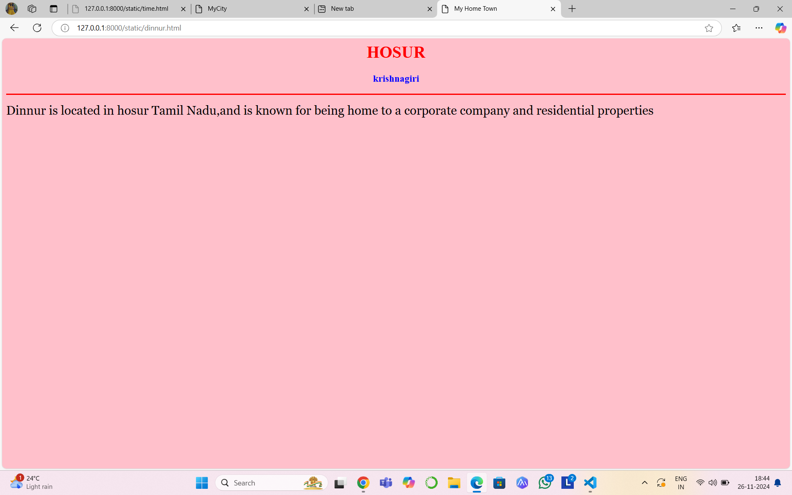
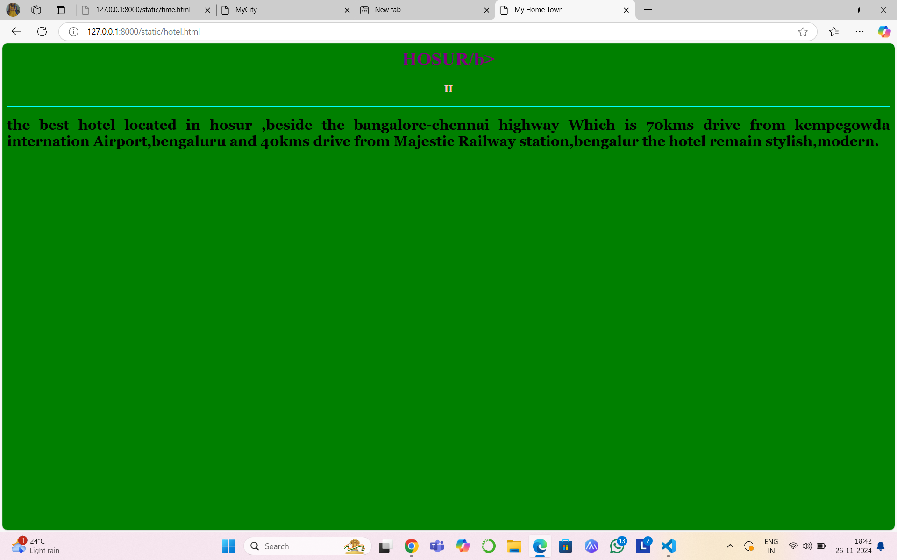
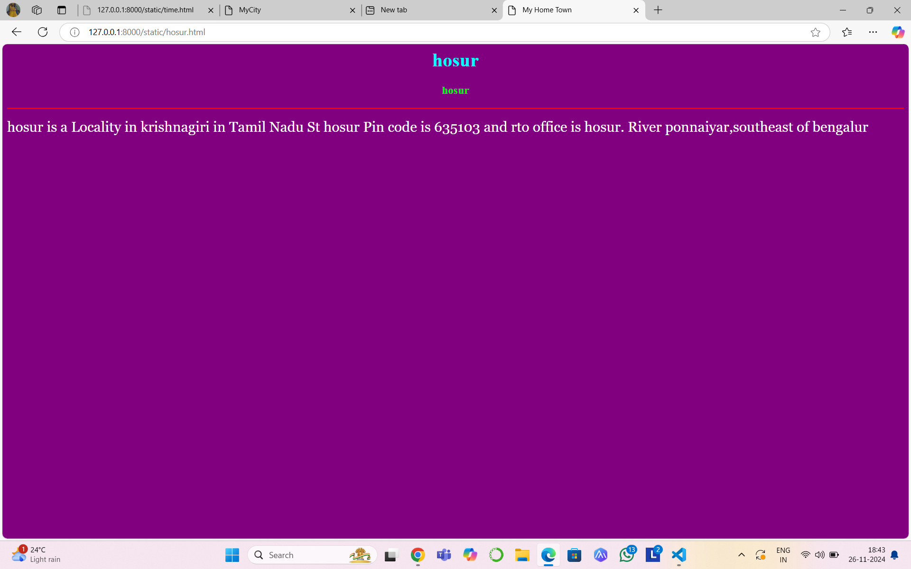
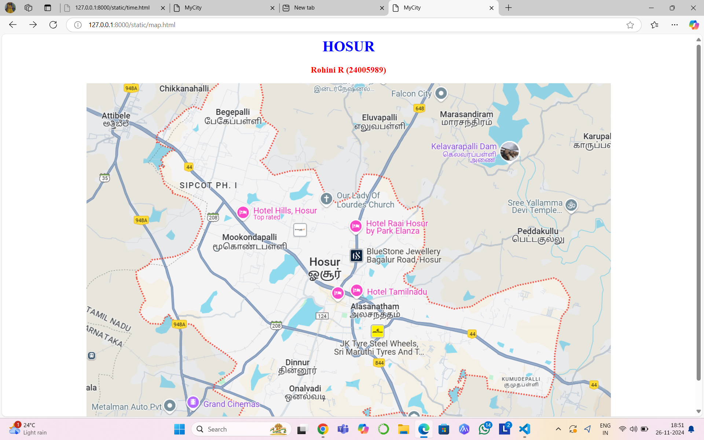

# Ex04 Places Around Me
## Date: 26.11.2024

## AIM
To develop a website to display details about the places around my house.

## DESIGN STEPS

### STEP 1
Create a Django admin interface.

### STEP 2
Download your city map from Google.

### STEP 3
Using ```<map>``` tag name the map.

### STEP 4
Create clickable regions in the image using ```<area>``` tag.

### STEP 5
Write HTML programs for all the regions identified.

### STEP 6
Execute the programs and publish them.

## CODE
```
cinema.html
<html>
<head>
<title>My Home Town</title>
</head>
<body bgcolor="lime">
<h1 align="center">
<font color="red"><b>HOSUR</b></font>
</h1>
<h3 align="center">
<font color="blue"><b>krishnagiri</b></font>
</h3>
<hr size="3" color="red">
<p align="justify">
<font face="Georgia" size="5" color="white">
    Grand cinemas is located in karunaa bus stop,tally road,hosur
</font>
</p>
</body>
</html>

dam.html
<html>
<head>
<title>My Home Town</title>
</head>
<body bgcolor="pink">
<h1 align="center">
<font color="red"><b>HOSUR</b></font>
</h1>
<h3 align="center">
<font color="blue"><b>krishnagiri</b></font>
</h3>
<hr size="3" color="red">
<p align="justify">
<font face="Georgia" size="5">
The Kelavarpalli Dam is a small dam in avalapalli,hosur,Tamil Nadu
</font>
</p>
</body>
</html>

dinnur.html
<html>
<head>
<title>My Home Town</title>
</head>
<body bgcolor="pink">
<h1 align="center">
<font color="red"><b>HOSUR</b></font>
</h1>
<h3 align="center">
<font color="blue"><b>krishnagiri</b></font>
</h3>
<hr size="3" color="red">
<p align="justify">
<font face="Georgia" size="5" coloe=":white">
Dinnur is located in hosur Tamil Nadu,and is known for being home to a corporate company and residential properties
</font>
</p>
</body>
</html>

hosur.html
<html>
<head>
<title>My Home Town</title>
</head>
<body bgcolor="purple">
<h1 align="center">
<font color="cyan"><b>hosur</b></font>
</h1>
<h3 align="center">
<font color="lime"><b>hosur</b></font>
</h3>
<hr size="3" color="red">
<p align="justify">
<font face="Georgia" size="5" color="white">
hosur is a Locality in krishnagiri in Tamil Nadu St
hosur Pin code is 635103 and rto office is hosur.
River ponnaiyar,southeast of bengalur
</font>
</p>
</body>
</html>

hotel.html
<html>
<head>
<title>My Home Town</title>
</head>
<body bgcolor="pink">
<h1 align="center">
<font color="cyan"><b>HOSUR/b></font>
</h1>
<h3 align="center">
<font color="green"><b>H</b></font>
</h3>
<hr size="3" color="cyan">
<p align="justify">
<font face="Georgia" size="5" colhoteor="white">
    the best hotel located in hosur ,beside the bangalore-chennai highway Which is 70kms drive from kempegowda internation Airport,bengaluru and 40kms drive from Majestic Railway station,bengalur
the hotel remain stylish,modern.
</font>
</p>
</body>
</html>

map.html
<html>
<head>
<title>MyCity</title>
</head>
<body>
<h1 align="center">
<font color="blue"><b>HOSUR</b></font>
</h1>
<h3 align="center">
<font color="red"><b>Rohini R (24005989)</b></font>
</h3>
<center>

    <map name="image-map">
        <area target="" alt="hosur" title="hosur" href="hosur.html" coords="465,371,578,441" shape="rect">
        <area target="" alt="grand cinema" title="grand cinema" href="cinema.html" coords="300,685,98" shape="circle">
        <area target="" alt="dinnur" title="dinnur" href="dinnur.html" coords="409,592,523,647" shape="rect">
        <area target="" alt="hotel hills" title="hotel hills" href="hotel.html" coords="429,252,487,229,522,308,361,326,357,265,383,236,416,230" shape="poly">
        <area target="" alt="dam" title="dam" href="dam.html" coords="747,107,957,185" shape="rect">
    </map>
</center>
</h3>
</body>
</html>
```

## OUTPUT


.png>)





## RESULT
The program for implementing image maps using HTML is executed successfully.
